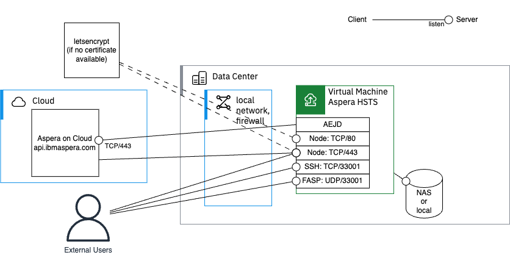

# IBM Aspera HSTS as tethered node in AoC

<!-- https://docs.github.com/en/get-started/writing-on-github/getting-started-with-writing-and-formatting-on-github/basic-writing-and-formatting-syntax#alerts -->
<!-- NOTE TIP IMPORTANT WARNING CAUTION -->

## Introduction

The procedure is documented in the **Aspera on Cloud** manual:

<https://ibmaspera.com/help/0_tethered_map>

<https://www.ibm.com/docs/en/aspera-on-cloud?topic=node-tether-your-aspera-transfer-server-aspera-cloud>

The procedure below is similar.

Instead of a metered transfer server license, we use here a license file.
This is adapted for evaluations or to use a perpetual license.

This procedure is especially adapted to set up a self-managed **Aspera High-Speed Transfer Server** (HSTS) or **Aspera High-Speed Transfer Endpoint** (HSTE) as a tethered node to **Aspera on Cloud** (AoC) for a Proof of Concept (PoC) or evaluation.

> [!NOTE]
> For Aspera Endpoint (HSTE), transfers with Connect Client version 3 is not supported.
> Also, a special configuration is required (see later)

### Assumptions

The VM where HSTS will run has a direct internet connection (no forward, no reverse proxy): it can reach internet, and can be reached from internet.
If NAT is used for the Node API, then we assume here that the same port is used for external and internal, else both ports shall be listened by **Nginx** so that both external and internal users can reach it.
If proxies are used/needed, then additional configuration can be done, not covered here.

> [!NOTE]
> It is also possible to use HTTPS instead of SSH for the TCP connection for transfers.
> In that case, a single HTTPS port may be shared between node and transfer.
> That requires additional configuration in **Nginx**.

### Pre-requisites

In order to tether a self-managed node to **Aspera on Cloud**, the following are requited:

- A self-managed **Linux** system with admin (`root`) access (e.g. Rocky 9)
- [Official hardware requirements](https://www.ibm.com/support/pages/system-sizing-guidelines-aspera-transfer-products), typically 4 cores, 8GB RAM
- A public IP address
- The server is reachable in this address on a minimum of 2 TCP ports (for Node : 443 and SSH : 33001) and 1 UDP port (for FASP : 33001), so typically TCP/443 TCP/33001 UDP/33001 (configurable)
- A DNS A record (FQDN) for that IP address (or use a free DNS provider, see later)
- A TLS certificate for that FQDN (or use a free certificate provider, see later)
- A license file provided by IBM. For example, an evaluation license file:

  `87650-AsperaEnterprise-unlim.eval.aspera-license`

- The installation package for HSTS: for example:

  `ibm-aspera-hsts-4.4.5.1646-linux-64-release.rpm`

> [!NOTE]
> The installation is also possible on other supported OS (macOS, Windows, ...).
> This manual focusses on Linux.

### Network and ports

In order to work with **Aspera on Cloud**, it is required to have a **public IP address** on which the following ports are open:

| Port      | Usage                              |
|-----------|------------------------------------|
| TCP/33001 | FASP Session (SSH)                 |
| UDP/33001 | FASP Data                          |
| TCP/443   | Node API (HTTPS)                   |
| TCP/80    | Optional: if `letsencrypt` is used |

> [!NOTE]
> Let's encrypt can be used on either port 80 or port 443.
> See later in this document.



## Preparation

Before starting the actual installation and configuration, some elements shall be prepared in advance.

### Download the HSTS/HSTE installation package

To download the RPM for HSTS (or HSTE), one can use the following methods:

- If you are an IBMer or have access to the Aspera downloads:

  - Go to <https://ibm.com/aspera>
  - Navigate to **Download and Documentation**, and then **Server**
  - Select **Download Now** for HSTS

    That bring to [Fix Central](https://www.ibm.com/support/fixcentral/swg/selectFixes?parent=ibm%7EOther%20software&product=ibm/Other+software/IBM+Aspera+High-Speed+Transfer+Server&release=All&platform=Linux+x86_64&function=all)
  - Click on the desired HSTS or HSTE version, and then make sure to select **HTTP Download**
  - Then **right-click** on the RPM link, and do **Copy link location**

    This represents a temporary direct download URL
  - Then follow the instructions below

- If IBM provided with a private link to fix central:

  - Navigate to the provided private link
  - Click on the desired HSTS version, and then make sure to select **HTTP Download**
  - Then **right-click** on the RPM link, and do **Copy link location**
  
    This represents a temporary direct download URL
  - Then follow the instructions below

- If you were provided with the direct download link (temporary), just follow the instructions below

On Linux execute:

```shell
wget [URL link from previous step here]
```

Alternatively, if `wget` is not available, `curl` is always present:

```shell
curl -o [paste only the file name of RPM] [paste the full link here]
```

For the license file, you can directly `vi` on Linux, and paste inside.
Alternatively, use `scp` to transfer those files.

You will set the path to those two files in the variables in next section.

### DNS record

A Fully Qualified Domain Name (FQDN) with a DNS A record is required for the public address of the HSTS.

If no domain is available, you can use a free service like [FreeDNS](https://freedns.afraid.org/) for proof-of-concept (PoC) purposes.

When choosing a domain on FreeDNS, select one with a lower number of users to avoid potential restrictions when generating the Let's Encrypt certificate.

### Certificate

If no certificate is available for the public address, a procedure is provided later in this document to generate one using Let's Encrypt.

## Installation and configuration of tethered node

We assume here that a compatible Virtual (or physical) Machine is installed with a RHEL-compatible Linux distribution: RHEL, Rocky Linux, Alma Linux, etc...

> [!IMPORTANT]
> The following commands are executed as a normal user with `sudo` access for `root`.

> [!NOTE]
> We need to generate some secrets of a minimum given length.
> Several tools can be used for random.
> For example, we will use `LANG=C tr -dc 'A-Za-z0-9'</dev/urandom|head -c 40` to generate a 40 character random string.
> When a base64 value is needed, then `openssl rand -base64 40|head -c 40` is used.

### Installation parameters

The next sections will use parameters that need to be defined.
These parameters are described in the following table.

| Parameter                | Description                                                   |
|--------------------------|---------------------------------------------------------------|
| `aspera_hsts_folder`     | The installation folder of HSTS.                              |
| `aspera_storage_root`    | The top folder under which Aspera will transfer files.        |
| `aspera_install_package` | Path to the HSTS RPM that you downloaded.<br/>e.g. `./ibm-aspera-hsts-4.4.5.1646-linux-64-release.rpm` |
| `aspera_license_file`    | Path to the Aspera HSTS license file.<br/>e.g. `./87650-AsperaEnterprise-unlim.eval.aspera-license`    |
| `aspera_cert_email`      | Place your email, this is used by `letsencrypt` to notify you when the certificate will expire. |
| `aspera_fqdn`            | Place your server's DNS address.<br/>For example, I used IBM Techzone and FreeDNS: `itzvsi-f0pjbk8h.mojok.org` |
| `aspera_os_user`         | Typically `xfer`.<br/>The operating system user under which transfers will be executed. |
| `aspera_node_user`       | The main administrative API user who will create access keys. |
| `aspera_node_pass`       | Password for the main node use.                               |
| `aspera_node_local_addr` | Address where node can be contacted locally.                  |
| `aspera_node_local_port` | The local port where `asperanoded` listens.                   |
| `aspera_node_local_secu` | `s` for HTTPS, and empty for HTTP.<br/>It refers to the local port listened by `asperanoded`. |
| `aspera_node_local_url`  | The URL for above parameters.                                 |
| `aspera_https_local_port`| Local port where HTTPS is acceble from local network, i.e. port of proxy. |
| `aspera_https_ext_port`  | The external port on which HTTPS will be reachable. Typically, `443`. |
| `aspera_node_ext_url`    | The URL where Node API is accessible from internet.           |
| `aspera_htgw_local_port` | Local port for httpgw, if configured.                         |

For convenience, let's create a shell configuration file named `./aspera_vars.sh` to store the parameters used.
This assumes you are working within the aspera_installation folder located in the current user's home directory.

Execute the following commands in a terminal:

```shell
mkdir -p ~/aspera_installation
cd ~/aspera_installation
cat << 'END_OF_CONFIG' > ./aspera_vars.sh
aspera_hsts_folder=/opt/aspera
aspera_storage_root=_path_to_main_storage_folder_
aspera_install_package=_path_to_hsts_rpm_
aspera_license_file=_path_to_license_file_
aspera_cert_email=_your_email_here_
aspera_fqdn=_your_server_fqdn_here_
aspera_os_user=xfer
aspera_node_user=node_admin
aspera_node_local_addr=127.0.0.1
aspera_node_local_port=9092
aspera_node_local_secu=s
aspera_node_local_url=http$aspera_node_local_secu://$aspera_node_local_addr:$aspera_node_local_port
aspera_https_local_port=443
aspera_https_ext_port=443
aspera_node_ext_url=https://$aspera_fqdn:$aspera_https_ext_port
aspera_htgw_local_port=7443
PATH=$aspera_hsts_folder/bin:/usr/local/bin:$PATH
END_OF_CONFIG
echo aspera_node_pass=$(LANG=C tr -dc 'A-Za-z0-9'</dev/urandom|head -c 40) >> ./aspera_vars.sh
```

Once created, edit the generated file `./aspera_vars.sh` and customize with your own values.

```shell
vi ./aspera_vars.sh
```

Once modified, reload the values:

```shell
source ./aspera_vars.sh
```

> [!TIP]
> At any time, if you open a new terminal, you can reload the configuration variables with above command.
> If you like, you may set the `PATH` in your shell profile as above.

### General system settings

#### General configuration: Linux

> [!NOTE]
> **Linux** only.

Once the DNS name is known:

```shell
echo $aspera_fqdn > /etc/hostname
hostname $aspera_fqdn
hostname
```

Let's add `sudo` for the current user:

```shell
echo "$USER ALL=(ALL) NOPASSWD: ALL" | sudo tee /etc/sudoers.d/$USER-nopasswd > /dev/null
sudo chmod 440 /etc/sudoers.d/$USER-nopasswd
```

Check that the system has date synchronization:

```shell
timedatectl
```

If not, then install time synchronization (e.g. `chrony`) and set timezone according to your preference.

```shell
sudo dnf install -y chrony
sudo systemctl enable --now chronyd
sudo timedatectl set-timezone Europe/Paris
```

Make sure that SELinux is disabled: execute:

```shell
sestatus|grep mode:
```

```text
Current mode:                   permissive
```

If mode is `enforcing`:

- Changes the current operation mode, execute:

```shell
sudo setenforce Permissive
```

- Change the mode at system startup, execute:

```shell
sudo sed -i 's/^SELINUX=.*/SELINUX=permissive/' /etc/selinux/config
```

> [!TIP]
> One can check again with `sestatus`

#### General configuration: **macOS**

> [!NOTE]
> **macOS** only.

Check **macOS** version:

```shell
sw_vers
```

Let's add `sudo` for the current user:

```shell
sudofile=/etc/sudoers.d/$USER-nopasswd
echo "$USER ALL=(ALL) NOPASSWD: ALL" | sudo tee $sudofile > /dev/null
sudo chmod 440 $sudofile
```

Check if `brew` is installed:

```shell
brew -v
```

If not, let's install [brew](https://brew.sh/):

```shell
NONINTERACTIVE=1 /bin/bash -c "$(curl -fsSL https://raw.githubusercontent.com/Homebrew/install/HEAD/install.sh)"
```

### Install the Aspera CLI

> [!NOTE]
> Installing the Aspera CLI is not mandatory, but it can be convenient.
> It can be installed locally or on a remote system (e.g., Windows, **macOS**, etc.).

User Manual: <https://github.com/IBM/aspera-cli>

After installation, check with:

```shell
ascli -v
```

#### Aspera CLI: Linux

```shell
dnf module -y reset ruby
dnf module -y enable ruby:3.3
dnf install -y ruby-devel
gem install aspera-cli -v 4.24.1
```

#### Aspera CLI: **macOS**

Install ruby:

```shell
brew install ruby
if ! grep -v ruby ~/.zshrc;then
    echo 'export PATH="$(brew --prefix ruby)/bin:$PATH"' >> ~/.zshrc
    source ~/.zshrc
    echo 'export PATH="$(gem env gemdir)/bin:$PATH"' >> ~/.zshrc
    source ~/.zshrc
fi
gem install aspera-cli -v 4.24.1
```

### Install the HSTS software

#### Aspera Server: Linux

```shell
dnf install -y $aspera_install_package
```

> [!NOTE]
> `perl` is still required by the HSTS installer and also later by **Nginx**.

#### Aspera Server: **macOS**

```shell
name=${aspera_install_package%%-*}
hdiutil attach $aspera_install_package
sudo installer -pkg /Volumes/$name*/*.pkg -target /
hdiutil detach /Volumes/$name*
```

### Install the license file

It goes to `$aspera_hsts_folder/etc/aspera-license`.
This file must be world-readable, or at least readable by `asperadaemons` and transfer users (`xfer`).

```shell
sudo cp $aspera_license_file $aspera_hsts_folder/etc/aspera-license
sudo chmod a+r $aspera_hsts_folder/etc/aspera-license
ascp -A
```

### Declare the Aspera shell (`aspshell`)

> [!NOTE]
> Linux and **macOS**.
> Optional, good practice, removes some warnings.

As Aspera uses SSH by default, a protection is provided with a secure shell: `aspshell`.
This shell can be declared as legitimate shell to avoid warning messages (optional):

```shell
grep -qxF '/bin/aspshell' /etc/shells || echo '/bin/aspshell' | sudo tee -a /etc/shells > /dev/null
```

### Aspera logs: Linux

> [!NOTE]
> Optional, but it is convenient.
> Aspera logs use syslog and facility `local2`.
> By default, logs go to `/var/log/messages` with `rsyslog`.

Configure logging per process for Aspera.

```shell
sudo sed -i -Ee 's/(;cron.none)(\s+\/var\/log\/messages)/\1;local2.none\2/' /etc/rsyslog.conf
echo 'local2.* -/var/log/aspera.log' | sudo tee /etc/rsyslog.d/99aspera_log.conf > /dev/null
sudo tee /etc/logrotate.d/aspera > /dev/null << 'EOF'
/var/log/aspera.log
{
  rotate 5
  weekly
  postrotate
    /usr/bin/killall -HUP rsyslogd
  endscript
}
EOF
for d in asperanoded asperaredisd asperacentral asperawatchd asperawatchfolderd asperarund asperahttpd http-gateway ascli async faspio-gateway;do
  l=/var/log/${d}.log
  echo 'if $programname == '"'$d'"' then { action(type="omfile" file="'${l}'") stop }' | sudo tee /etc/rsyslog.d/00${d}_log.conf > /dev/null
  sudo sed -i -e '/aspera.log/ a '${l} /etc/logrotate.d/aspera
done
sudo systemctl restart rsyslog
```

### Create transfer user

When used with **Aspera on Cloud**, all transfers are executed under a single technical user (transfer user): `xfer`, specified by `$aspera_os_user`.
Optionally we can create a group `asperausers` in case we need to manage multiple transfer users.
We make sure to block password-based login with that user and ensure it never expires.

#### Transfer user: Linux

```shell
groupadd asperausers
useradd --create-home --no-user-group --gid asperausers --shell /bin/aspshell $aspera_os_user
passwd --lock $aspera_os_user
chage --mindays 0 --maxdays 99999 --inactive -1 --expiredate -1 $aspera_os_user
```

#### Transfer user: **macOS**

Create a user group: `asperausers` and user `xfer`

```shell
aspera_group=asperausers
if ! dscl . -read /Groups/$aspera_group &>/dev/null; then
  sudo dscl . -create /Groups/$aspera_group
  sudo dscl . -create /Groups/$aspera_group RealName "Aspera Users"
  sudo dscl . -create /Groups/$aspera_group gid 600
fi
if ! id "$aspera_os_user" &>/dev/null; then
  sudo dscl . -create /Users/$aspera_os_user
  sudo dscl . -create /Users/$aspera_os_user UserShell /bin/aspshell
  sudo dscl . -create /Users/$aspera_os_user RealName "Aspera User"
  sudo dscl . -create /Users/$aspera_os_user UniqueID "$(dscl . -list /Users UniqueID | awk 'max<$2{max=$2} END{print max+1}')"
  sudo dscl . -create /Users/$aspera_os_user PrimaryGroupID "$(dscl . -read /Groups/$aspera_group PrimaryGroupID | awk '{print $2}')"
  sudo dscl . -create /Users/$aspera_os_user NFSHomeDirectory /Users/$aspera_os_user
  sudo createhomedir -c -u $aspera_os_user > /dev/null
fi
sudo pwpolicy -u $aspera_os_user -setpolicy "isDisabled=1"
sudo pwpolicy -u $aspera_os_user -clearaccountpolicies
```

Allows user for ssh:

```shell
sudo dseditgroup -o edit -a xfer -t user com.apple.access_ssh
```

### Define storage location root

Let's create some main storage location that will be used by Aspera and make it accessible by the transfer user:

```shell
sudo mkdir -p $aspera_storage_root
sudo chown $aspera_os_user: $aspera_storage_root
```

### Transfer Server configuration file

> [!NOTE]
> Informational section.

The Aspera Transfer Server contains configuration in two places:

- Static Configuration: Located in XML file: `$aspera_hsts_folder/etc/aspera.conf`
- Dynamic Information: In a Redis database

Although the file `aspera.conf` can be edited, it is not recommended.
Instead, use the following tools

- `asconfigurator`: Can be used to modify or get the information from `aspera.conf`.
- `asuserdata`: To display information from `aspera.conf` in a more human-readable way, as well to display available parameters.

Typically:

1. Dump available parameters with: `asuserdata -a`
2. Show command for parameter with: `asuserdata -+ | grep <parameter>`
3. Execute modification command: `asconfigurator -x "..."`

Other user: show current and default value for a parameter with `option_mask`: `asconfigurator -x 'get_server_data;option_mask,ssl_ciphers'`

### Configure token encryption key

When using **Aspera Transfer Token**, those are encrypted with a symmetric key.
It needs to be provisioned, either as a static key in `aspera.conf` or as a dynamic key in Redis.

It is easier to use a static token encryption key:

```shell
sudo $aspera_hsts_folder/bin/asconfigurator -x "set_node_data;token_dynamic_key,false;token_encryption_key,$(LANG=C tr -dc 'A-Za-z0-9'</dev/urandom|head -c 40)"
```

Use of dynamic key is described in the [appendix](#dynamic-token-encryption-key).

### Configure the transfer user for use with tokens

When transfers are authorized with tokens (Aspera Transfer Token or Bearer token, or even Basic token) and if SSH transport is used, then the transfer user must be configured to use public key authentication with Aspera's bypass key.

```shell
aspera_home=$(eval echo ~$aspera_os_user)
sudo mkdir -p $aspera_home/.ssh
sudo cp $aspera_hsts_folder/var/aspera_tokenauth_id_rsa.pub $aspera_home/.ssh/authorized_keys
sudo chmod -R go-rwx $aspera_home/.ssh
sudo chown -R $aspera_os_user: $aspera_home
```

### Other configuration for AoC

**Aspera on Cloud** requires activity logging:

```shell
sudo $aspera_hsts_folder/bin/asconfigurator -x 'set_server_data;activity_logging,true;activity_event_logging,true;activity_file_event_logging,true;activity_bandwidth_logging,true;files_recursive_counts_workers,5'
sudo $aspera_hsts_folder/bin/asconfigurator -x 'set_node_data;pre_calculate_job_size,yes;async_activity_logging,true;partial_file_suffix,.inprogress'
```

By default, the HSTS uses caching for folder contents.
To deactivate folder content caching, execute (Optional, Default: 5m):

```shell
sudo $aspera_hsts_folder/bin/asconfigurator -x 'set_server_data;files_cache_ttl,0'
```

Folder caching is useful when reading folder content is slow, due to slow storage or large number of files in folders.

### Node API user

To access the HSTS API and create an access key, we first need to provision an API user.

```shell
sudo $aspera_hsts_folder/bin/asnodeadmin -a -u $aspera_node_user -p $aspera_node_pass -x $aspera_os_user
```

Access keys created with this API user will enable transfers that run on the host under the operating system user `$aspera_os_user`.

To allow access key creation, any **docroot** must be removed, and appropriate storage restrictions must be defined.
These restrictions limit the location of storage root for access keys.
For more details, refer to the [Appendix](#transfer-user-file-restrictions).

The simplest approach is to define a loose restriction:

```shell
sudo $aspera_hsts_folder/bin/asconfigurator -x "set_user_data;user_name,$aspera_os_user;absolute,AS_NULL;file_restriction,|*"
```

Use of a token is mandatory, so it must be enabled and enforced for the transfer user.

```shell
sudo $aspera_hsts_folder/bin/asconfigurator -x "set_user_data;user_name,$aspera_os_user;authorization_transfer_in_value,token;authorization_transfer_out_value,token"
```

When parameters for `asperanoded` (Node API server) are modified, one shall restart the daemon to reload the configuration:

> [!NOTE]
> Similar effect can be achieved with `asnodeadmin --reload`.
> In case of installation, one can just restart the daemon for config reload.

> [!NOTE]
> **Linux** only.
> Execute the following command:

```shell
systemctl restart asperanoded
```

> [!NOTE]
> **macOS** only.
> Execute the following command:

```shell
sudo launchctl unload /Library/LaunchDaemons/com.aspera.asperanoded.plist
sudo launchctl load /Library/LaunchDaemons/com.aspera.asperanoded.plist
```

### SSH server configuration

By default, Aspera uses SSH for Aspera transfer session initiation.
It is also possible to configure HTTPS for token-based authorization.
As recommended by **IBM**, do not expose port 22, and prefer to use port `33001` for SSH connections for Aspera.
One can either use a single SSH server (`sshd`) for both remote terminal and Aspera transfers, or use a separate SSH server for Aspera transfers.

#### SSH Server configuration: **Linux**

> [!NOTE]
> **Linux** only.

This is the simplest configuration, as one only needs to configure the SSH server to listen on port `33001` instead of `22`.

Let's configure **SSH** to listen on port `33001` only:

```shell
sed -i '/^#Port 22$/a Port 33001' /etc/ssh/sshd_config
sed -i '/^#UseDNS yes$/a UseDNS no' /etc/ssh/sshd_config
sed -i '/^HostKey .*ecdsa_key$/s/^/#/ ' /etc/ssh/sshd_config
sed -i '/^HostKey .*ed25519_key$/s/^/#/ ' /etc/ssh/sshd_config
systemctl restart sshd
```

> [!TIP]
> To keep both 33001 and 22, uncomment the line: `#Port 22`, then restart the SSH service.

#### SSH Server configuration: **macOs**

> [!NOTE]
> **macOS** only

Change port on which `sshd` listens:

```shell
sudo sed -i.bak -E 's/^(ssh[[:space:]]+)[0-9]+(\/tcp.*)/\133001\2/' /etc/services
```

Activate `sshd`, graphically, or using the following:

```shell
sudo systemsetup -setremotelogin on
sudo lsof -iTCP:33001 -sTCP:LISTEN
```

If using an attached storage, you will also need to allow full disk access for ssh, and specifically allow the Aspera `xfer` user and admin:

Open **System settings** &rarr; **Sharing** &rarr; **Remote Session** (i)


- Activate "full disk access for users"
- Add the Aspera `xfer` user. (and admin if needed)
- Deactivate and Re-Activate Remote Session

In addition, if an external disk is used, one has to grant access to it to the `asperanoded` process:

Open **System settings** &rarr; **Confidentiality and Security** &rarr; **Full Disk Access**, and add `asperanoded` like this:

- Click on **+** (plus)
- Navigate to **Mocintosh HD**
- Press on keyboard: **command** and `.`. If `.` is on `<Shift>`, also press `<Shift>`.
- This reveals hidden files.
- Navigate to `/Library/Aspera/sbin`
- Select `asperanoded`
- Make sure it is activated as below:


See [Appendix: Access to storage](#access-to-storage-on-macos)

### Certificate for HTTPS

#### Using a certificate provided by an authority

```shell
cert_folder=_path_to_folder_
cert_fullchain_path=$cert_folder/_full_chain_file_
cert_fullchain_path=$cert_folder/_key_file_
```

#### Using **let's encrypt** and `certbot`: Linux

> [!NOTE]
> **Linux** only.

A TLS certificate is required for above FQDN.

If you don't have one, then it is possible to generate one with below procedure using `letsencrypt`:

Install `certbot`:

```shell
dnf install -y python3.12
python3 -m venv /opt/certbot/
/opt/certbot/bin/pip install --upgrade pip
/opt/certbot/bin/pip install certbot
ln -s /opt/certbot/bin/certbot /usr/bin/certbot
```

Generate a certificate:

```shell
certbot certonly --agree-tos --email $aspera_cert_email --domain $aspera_fqdn --non-interactive --standalone
cert_folder=/etc/letsencrypt/live/$aspera_fqdn
cert_fullchain_path=$cert_folder/fullchain.pem
cert_only_path=$cert_folder/
cert_privkey_path=$cert_folder/privkey.pem
```

> [!NOTE]
> For above command to work, the FQDN shall resolve in DNS and port TCP/443 reachable.
> Certificate and key is placed here: `/etc/letsencrypt/live/$aspera_fqdn/`.
> See [Let's encrypt documentation](https://letsencrypt.org/docs/challenge-types/#http-01-challenge)

#### Using **let's encrypt** and `acme.sh`: **macOS**

```shell
brew install acme.sh
```

Generate certificate using [tls-alpn-01 challenge on port 443](https://letsencrypt.org/fr/docs/challenge-types/#tls-alpn-01):

```shell
acme.sh --set-default-ca --server letsencrypt
acme.sh --register-account -m $aspera_cert_email
acme.sh --issue --alpn --tlsport $aspera_https_local_port -d $aspera_fqdn
cert_folder=$(dirname $(acme.sh --info -d $aspera_fqdn|sed -n 's/^DOMAIN_CONF=//p'))
cert_fullchain_path=$cert_folder/fullchain.cer
cert_intermediate_path=$cert_folder/ca.cer
cert_only_path=$cert_folder/$aspera_fqdn.cer
cert_privkey_path=$cert_folder/$aspera_fqdn.key
set|grep ^cert_
```

### Not using Nginx

> [!NOTE]
> **macOS** only.
> [Documentation](https://www.ibm.com/docs/en/ahts/4.4.x?topic=suhna-installing-ssl-certificates-1)

If `asperanoded` is used directly without `nginx`, then a certificate shall be installed:

```shell
cert_real_base=$aspera_hsts_folder/etc/real_cert
cert_real_key=$cert_real_base.key
cert_real_cert=$cert_real_base.full
cert_real_chain=$cert_real_base.chain
sudo cp $cert_privkey_path $cert_real_key
sudo cp $cert_only_path $cert_real_cert
sudo cp $cert_intermediate_path $cert_real_chain
sudo chown asperadaemon: $cert_real_base*
sudo $aspera_hsts_folder/bin/asconfigurator -x "set_server_data;key_file,$cert_real_key;cert_file,$cert_real_cert;chain_file,$cert_real_chain"
sudo launchctl unload /Library/LaunchDaemons/com.aspera.asperanoded.plist
sudo launchctl load /Library/LaunchDaemons/com.aspera.asperanoded.plist
```

To add admin user to group `aspadmins`:

```shell
sudo dseditgroup -o edit -a laurent -t user aspadmins
```

To change a folder to group `aspadmins`:

```shell
chgrp aspadmins .
chgrp -R aspadmins .acme.sh
chmod g+r $cert_privkey_path
```

To check content of cert bundle:

```shell
cat bundle.cer | awk '/BEGIN CERTIFICATE/{buf=$0 ORS;next}/END CERTIFICATE/{buf=buf $0 ORS;print buf | "openssl x509 -noout -subject";close("openssl x509 -noout -subject");buf="";next}{buf=buf $0 ORS}' | sed -n 's/.*CN=\(.*\)/\1/p'
```

### Nginx

Technically, **Nginx** is not required, but it is recommended when the Node API faces Internet, and it has several advantages.
It :

- allows using port 443 for HTTPS, as `asperanoded` runs as user `asperadaemon` and cannot bind to port `443`,
- simplifies the installation of certificates,
- adds a security layer with a well-known reverse proxy,
- allows to use a single port for both Node API and transfers (WSS, if configured) and other services.

#### Change `asperanoded` local port

> [!NOTE]
> Do this part only if you want to front-end `asperanoded` with nginx
> and possibly share the HTTPS port between multiple applications

Since we will use **Nginx** as reverse proxy, we can make Node API listen locally only:

```shell
sudo $aspera_hsts_folder/bin/asconfigurator -x "set_server_data;listen,$aspera_node_local_addr:$aspera_node_local_port$aspera_node_local_secu"
```

Type `s` is for HTTPS.
Restart is required to change listening address.

> [!WARNING]
> **Linux** only.
> Execute the following command:

```shell
systemctl restart asperanoded
```

> [!WARNING]
> **macOS** only.
> Execute the following command:

```shell
sudo launchctl unload /Library/LaunchDaemons/com.aspera.asperanoded.plist
sudo launchctl load /Library/LaunchDaemons/com.aspera.asperanoded.plist
```

#### Install **Nginx**: Linux

```shell
dnf install -y nginx
nginx_log='access_log               /var/log/nginx/'
nginx_etc=/etc/nginx
```

#### Install **Nginx**: **macOS**

```shell
brew install nginx
nginx_log='# '
nginx_etc=/opt/homebrew/etc/nginx
nginx_log_dir=/opt/homebrew/var/log/nginx
```

#### Configure **Nginx**

Create a configuration file for **Nginx**:

```shell
sudo tee $nginx_etc/nginx.conf > /dev/null << EOF
# Aspera configuration - reverse proxy for components
worker_processes auto;
events {
  worker_connections  1024;
}
http {
  server {
    listen                     $aspera_https_local_port ssl;
    listen                     [::]:$aspera_https_local_port ssl;
    server_name                _;
    root                       /usr/share/nginx/html;
    ssl_certificate            $cert_fullchain_path;
    ssl_certificate_key        $cert_privkey_path;
    ssl_session_cache          builtin:1000 shared:SSL:10m;
    ssl_protocols              TLSv1.2 TLSv1.3;
    ssl_ciphers ECDH+AESGCM:DH+AESGCM:ECDH+AES256:DH+AES256:ECDH+AES128:DH+AES:RSA+AESGCM:RSA+AES:!aNULL:!MD5:!DSS;
    ssl_prefer_server_ciphers  on;
    $nginx_log global.access.log;
    server_tokens              off;
    proxy_set_header           Host              \$host;
    proxy_set_header           X-Real-IP         \$remote_addr;
    proxy_set_header           X-Forwarded-For   \$proxy_add_x_forwarded_for;
    proxy_set_header           X-Forwarded-Proto \$scheme;
    proxy_read_timeout         90;
    proxy_buffering            off;
    proxy_request_buffering    off;

    # HSTS: node API
    location / {
      proxy_pass               $aspera_node_local_url;
      $nginx_log node.access.log;
    }
    # HTTP Gateway
    location /aspera/http-gwy {
      proxy_pass               https://127.0.0.1:$aspera_htgw_local_port;
      $nginx_log httpgw.access.log;
      proxy_http_version       1.1;
      proxy_set_header         Upgrade \$http_upgrade;
      proxy_set_header         Connection "Upgrade";
      proxy_set_header         Host \$host;
    }
  }
}
EOF
```

> [!TIP]
> If a reverse HTTP proxy is placed in front of the Node API, with a different port, then include both ports in the config file above.

Then start and enable it permanently (start on reboot):

Linux:

```shell
sudo systemctl enable --now nginx
```

macOS:

```shell
sudo brew services restart nginx
```

#### Verification

> [!NOTE]
> Ideally, below command shall be executed from outside the on-premise environment.
> The goal being to verify that **Aspera on Cloud** services can correctly access the on-premise server and that the certificate is well recognized from internet.

At this point, **Nginx** shall forward requests to the Node API and an API user and transfer user shall be configured.

Check with:

```shell
curl -u $aspera_node_user:$aspera_node_pass $aspera_node_ext_url/info
```

Check that the following values are set like this:

```json
"transfer_user" : "xfer",
"docroot" : "",
```

### Creation of access key and node

#### Using AoC web UI

In the **Aspera on Cloud** web UI, navigate to `[App Selector]` &rarr; `Admin` &rarr; `Nodes and storage` &rarr; `Create new +`

- Select tab: `Attach my Aspera server`
- **Name**: anything you like to identify this node by name
- **URL**: value of: `$aspera_node_ext_url`
- Leave other as default
- Select radio button `Create a new access key`
- Node username: `$aspera_node_user`
- Node password: `$aspera_node_pass`
- Storage: `Local Storage`
- Path: `$aspera_storage_root`

> [!NOTE]
> The Path used for access key creation must pass glob validation with the restriction list created earlier.
> If the glob was ending with a `*`, then the Path can be any folder below the folder prefix.

#### Using `ascli`

Here, we are going to create the access key using the CLI, which uses the node API.

##### Configure `ascli`

Configure access to Node API:

```shell
ascli config preset update node_admin --url=$aspera_node_ext_url --username=$aspera_node_user --password=$aspera_node_pass
ascli config preset set default node node_admin
```

##### Create the access key

```shell
ascli node access_keys create @json:'{"storage":{"type":"local","path":"'$aspera_storage_root'"}}' --show-secrets=yes|tee my_ak.txt
```

The access key credentials are displayed and saved in file: `my_ak.txt`

#### Create the node

In the **Aspera on Cloud** web UI, navigate to `Admin app` &rarr; `Nodes and storage` &rarr; `Create new +`

- Select tab: `Attach my Aspera server`
- **Name**: anything you like to identify this node by name
- **URL**: value of: `$aspera_node_ext_url`
- Leave other as default
- Select radio button `Use existing`
- Access key: value from `my_ak.txt`
- Secret: value from `my_ak.txt`

### Accessing AoC using command line

Configure access to **Aspera on Cloud**: `myorg` is the name of the AoC tenancy (organization), i.e. the first part of the address of the URL.
One can also place the URL of the org: `https://myorg.ibmaspera.com`

```shell
ascli config wizard [myorg] aoc
```

Then follow the Wizard.

> [!NOTE]
> When using the CLI, a user will be authenticated using a private key.
> AoC supports a single public key per user.
> If the user uses the CLI from multiple systems, then the same private key shall be used on those systems (for example on the Aspera Transfer Server, and on a laptop).

### Configure Aspera Event Journal Daemon (AEJD)

The Aspera Event Journal Daemon is responsible to report events from the Aspera Transfer Server, back to the Aspera on Cloud API.
It reports file events (transfers, etc...).

#### Special case: HSTE

> [!NOTE]
> **Linux** only.

If the transfer server is an **HSTS**, skip this step.

If the node is an **Aspera Endpoint**, then create this file: `/opt/aspera/etc/systemd/asperaejd.service` with this content:

```ini
[Unit]
Description=IBM Aspera Event Journal Daemon
ConditionPathExists=/opt/aspera/sbin/aejd
StartLimitInterval=0

[Service]
User=asperadaemon
Group=aspadmins
Type=simple
PIDFile=/opt/aspera/var/run/aspera/aejd.pid
ExecStart=/opt/aspera/sbin/aejd
ExecReload=/bin/kill -s HUP $MAINPID
TimeoutStopSec=20
KillMode=process
Restart=always
RestartSec=10s
```

Then activate **AEJD**.
Execute as root:

```shell
/opt/aspera/etc/setup/setup-systemd.sh enable
```

The AEJ Daemon shall now be known.
Its status can be shown with:

```shell
systemctl status asperaejd
```

> [!NOTE]
> As it is not yet configured, it may be in failed state.

#### Create a node registration token

This token can be used a single time.
It can be created using the AoC web UI, or using `ascli` (requires having configured access to AoC through `ascli`, see previous section):

This command saves the generated token in shell variable: `$registration_token`

```shell
registration_token=$(ascli aoc admin client_registration_token create @json:'{"data":{"name":"'"$aspera_fqdn"'","client_subject_scopes":["aejd"],"client_subject_enabled":true}}' --fields=token --show-secrets=yes)
```

To display the value:

```shell
echo $registration_token
```

This value will be used only once.

#### Activate the AEJ Daemon

Execute as `root` (Still assuming that `$aspera_hsts_folder/bin/` is in the `PATH`):

This command activate reporting of events from Node Daemon to the AEJ Daemon, once Node Daemon is restarted.

```shell
sudo $aspera_hsts_folder/bin/asconfigurator -x "set_server_data;aej_logging,true;aej_port,28000;aej_host,$aspera_node_local_addr"
```

Use the token from previous step in: `registration_token` variable.
This command creates the configuration file: `/opt/aspera/etc/aejd.conf` after calling back AoC API to register the node.

```shell
sudo $aspera_hsts_folder/bin/asp-cloud-config tether --aoc-registration-token $registration_token --aoc-url https://api.ibmaspera.com
sudo chmod 600 $aspera_hsts_folder/etc/aejd.json
sudo chown asperadaemon: $aspera_hsts_folder/etc/aejd.json
```

> [!NOTE]
> As of 4.4.5 HSTS, the command `asp-cloud-config` has a defect where the config file `aejd.conf` is created in `$PWD/../etc` instead of `/opt/aspera/etc` if the command is executed without a full path.
> So either move to `/opt/aspera/bin/` before executing, or use the full path to the command like proposed here.
> Also, the resulting file `aejd.json` shall be readable by user `asperadaemon`.

Restart Aspera services in that order to apply the configuration:

```shell
sudo systemctl restart asperaejd
sudo systemctl restart asperanoded
```

### Installation of HTTP Gateway

> [!NOTE]
> **Linux** only.

The HTTP Gateway can be installed on the same server as the Aspera Transfer Server.

#### Installation

```shell
sudo rpm -Uvh ibm-aspera-httpgateway-2.3.0.156-b3b9633.x86_64.rpm
```

#### Configuration

Make **HTTP Gateway** listen locally on high port.

```shell
cp /opt/aspera/httpgateway/config/{default,gatewayconfig}.properties
sed --in-place --regexp-extended \
--expression='s/^(serverconfig\.host)=.*/\1=127.0.0.1/' \
--expression="s/^(serverconfig\.port)=.*/\1=$aspera_htgw_local_port/" \
/opt/aspera/httpgateway/config/gatewayconfig.properties
systemctl restart aspera_httpgateway
```

Auto restart on failure:

```shell
service_file=/usr/lib/systemd/system/aspera_httpgateway.service
if ! grep -q '^Restart=' $service_file;then
  tmpfile=$(mktemp)
  cat > "$tmpfile" << EOF
Restart=on-failure
RestartSec=30s
EOF
  sed -i -Ee '/^\[Service\]/r '"$tmpfile"'' $service_file
  rm -f "$tmpfile"
  systemctl daemon-reload
  systemctl restart aspera_httpgateway
fi
```

#### NGINX Configuration

NGINX is configured as reverse proxy for HTTP Gateway.
See section NGINX Configuration for details.

## Maintenance operations

### Transfer server backup

Some configuration of the Transfer server can be re-created easily, such as node AI user, static configuration (`aspera.conf`) or even access keys.

But some other state information cannot be re-created, as it is the result of file transfers.
Such information include file identifiers and permissions.
Those are stored in a local database.
So it is important to proceed to a regular backup of this information.

In case of disaster, the Aspera transfer Server node shall be rebuilt.
This includes:

- installation and configuration of Operating system
- installation and configuration of Aspera Software
- installation and configuration of other Software (**Nginx**)
- restoration of state backup

An easy way to prevent disaster, in the case of use of Virtual Machines, is to perform a snapshot of the storage.

The installation and configuration of software can even be automated using tools such as Red Hat Ansible and IBM HashiCorp Terraform.

#### System files

Any customization to the OS must be restored, such as the ones listed in this document.

#### HSTS config files

The following files shall be backed up:

- `$aspera_hsts_folder/etc/aspera.conf`
- `$aspera_hsts_folder/etc/aspera-license`
- `$aspera_hsts_folder/etc/conf.d/node_id.conf`
- `$aspera_hsts_folder/etc/conf.d/cluster_id.conf`

#### HSTS Redis DB

Refer to the [HSTS documentation](https://www.ibm.com/docs/en/ahts) for details on backup and restore of the HSTS Redis database, section: `Backing up and restoring a node database`.

### Changing FQDN and certificate

If the hostname (FQDN) of the HSTS needs to be modified, the associated certificate also needs an update.

Prerequisites:

- Get a certificate for that new FQDN
- Register this FQDN in DNS (A or AAAA record)
- For convenience, edit the file `aspera_vars.sh` and update the value for `aspera_fqdn`.

```shell
sed -i.bak -E -e "s|^(aspera_fqdn=).*|\1newhost.example.com|" ./aspera_vars.sh
source ./aspera_vars.sh
set|grep ^aspera_
```

#### Updating local hostname

```shell
echo $aspera_fqdn > /etc/hostname
hostname $aspera_fqdn
```

Check with:

```shell
hostname
```

```text
newhost.example.com
```

Edit the file: `/etc/hosts`, and, at the end of the line with `127.0.0.1`, add that FQDN:

```text
127.0.0.1 localhost newhost.example.com
```

Alternatively:

```shell
echo "127.0.0.1 $aspera_fqdn" >> /etc/hosts
```

Check with (or with `ping`):

```shell
getent hosts $aspera_fqdn
```

```text
127.0.0.1 localhost newhost.example.com
```

> [!NOTE]
> This entry in `/etc/hosts` is used in case of a local HSTS transfer.
> In AoC that's the case for a move or a copy.

#### Storing the certificate and private key

The certificate chain and its key should be stored in a location accessible by **Nginx**.
It can be anywhere, including a standard location:

```shell
openssl version -d
```

```text
OPENSSLDIR: "/etc/pki/tls"
```

Let's store certificate files in standard locations:

- `/etc/pki/tls/certs/newhost.example.com.fullchain.pem`
- `/etc/pki/tls/private/newhost.example.com.key.pem`

Let's adjust access rights: By default, **Nginx** runs as user `nginx`

```shell
eval $(openssl version -d|sed 's/: /=/')
cert_fullchain_path=$OPENSSLDIR/certs/$aspera_fqdn.fullchain.pem
cert_privkey_path=$OPENSSLDIR/private/$aspera_fqdn.key.pem
chmod 644 $cert_fullchain_path
chmod 600 $cert_fullchain_path
chown nginx: $cert_fullchain_path
```

> [!NOTE]
> The certificate file should contain the full chain.

#### Configuration for **Nginx**

Refer to the [Nginx documentation](https://nginx.org/en/docs/http/configuring_https_servers.html).

Modify `/etc/nginx/nginx.conf`, and change parameters: `ssl_certificate` and `ssl_certificate_key` with above paths.

```shell
sed -i.bak -E -e "s|(ssl_certificate\s+).*;|\1$cert_fullchain_path;|" /etc/nginx/nginx.conf
sed -i.bak -E -e "s|(ssl_certificate_key\s+).*;|\1$cert_fullchain_path;|" /etc/nginx/nginx.conf
```

```shell
systemctl restart nginx
systemctl status nginx
```

Check with:

```shell
curl -i $aspera_node_ext_url/ping
```

```yaml
HTTP/1.1 200 OK
Server: nginx
Date: Mon, 05 May 2025 14:11:27 GMT
Transfer-Encoding: chunked
Connection: keep-alive
```

#### Change the node URL in AoC

This can be done using the web UI: **Admin** &rarr; **Nodes and storage** &rarr; **Nodes** &rarr; **Profile** or the CLI as below.

First identify the node identifier that you configured:

```shell
ascli aoc admin node list
```

Either use the numerical identifier `_my_node_id_`, or, if you know the name: `%name:"my node name"`

```shell
ascli aoc admin node modify _my_node_id_ @json:'{"url":"'$aspera_node_ext_url'"}'
```

## Appendix

This section contains special procedures

### Dynamic token encryption key

Refer to the HSTS [Documentation](https://www.ibm.com/docs/en/ahts/4.4.x?topic=linux-secrets-management-askmscli).

If you prefer to use dynamic keys:

- First, initialize the global secret (requires a 32 bytes key, base64 encoded): using either `openssl rand -base64 32` or `head -c 32 /dev/urandom|base64` depending on your system:

```shell
openssl rand -base64 32|askmscli --set-secret-by-category=redis-primary-key
```

> [!NOTE]
> This command is done only once, and creates the SQLite DB file `$aspera_hsts_folder/etc/rootkeystore.db`.
> One can peek in this file with: `sqlite3 $aspera_hsts_folder/etc/rootkeystore.db .dump`

- Then, set the key for the transfer user:

```shell
askmscli --init-keystore --user=$aspera_os_user
```

> [!NOTE]
> This command creates the SQLite DB file `~xfer/.aspera/localkeystore.db` with a copy of the primary key.

- Finally, enable dynamic token encryption key:

```shell
sudo $aspera_hsts_folder/bin/asconfigurator -x 'set_node_data;token_dynamic_key,true;token_encryption_key,AS_NULL'
```

### Transfer user file restrictions

The transfer user is associated to a **list** of **file restrictions**.
Also, the `docroot` shall not be defined for that transfer user.
A **restriction** is a [**glob**](https://en.wikipedia.org/wiki/Glob_(programming)) (i.e. pattern, not a regex).

Aspera glob syntax is as follows:

- `?` match any single character
- `*` match any number of any character
- `\` escapes the next character (to protect evaluation of one of the special characters: `?*\`)
- any other character is compared as-is

> [!NOTE]
> Aspera glob match bytes (8-bit) and does not consider any multibyte encoding (such as UTF8). UTF8 match should work.

For example, for a restriction: `file:////data/*` :

| Path                   | Match? |
|------------------------|--------|
| `file:////data/`       | yes    |
| `file:////mnt/`        | no     |
| `file:////data/folder` | yes    |

The syntax of declaration of that **list** in `asconfigurator` is: `[character][item1][character][item2]...`.
The leading character can be anything, and is used as separator later.
Typically, `|` is used.

If we want to restrict creation of access keys to only folders under the selected storage location: `$aspera_storage_root`, then one can do:

```shell
sudo $aspera_hsts_folder/bin/asconfigurator -x "set_user_data;user_name,$aspera_os_user;absolute,AS_NULL;file_restriction,|file:///$aspera_storage_root/*"
```

Internally, in HSTS, storage locations are stored as a URI:

```text
[scheme]://[storage server+credential]/[path]?[parameters]
```

For local storage, `[scheme]` is `file`, and the absolute path starts with `/`.
For example, for a local storage `/data`, the URL would be `file:////data`.

When creating an access key, the storage root URI is validated against a list of restriction globs.

> [!NOTE]
> An access key is configured with a storage location specified in JSON format, not as a URI.
> Internally, Aspera converts this location to a URI and checks whether it matches one of the patterns (globs) defined in the restriction list.

If the restriction list contains only `file:////data` (without any glob pattern), then only that exact path will be allowed.
To allow access to **any path** under two locations, `/data/mnt1` and an S3 bucket `s3://mys3/bucket`, the restriction list should include:

- `file:////data/mnt1/*`
- `s3://mys3/bucket/*`

The corresponding command would be:

```shell
sudo $aspera_hsts_folder/bin/asconfigurator -x "set_user_data;user_name,$aspera_os_user;absolute,AS_NULL;file_restriction,|file:////data/mnt1/*|s3://mys3/bucket/*"
```

> [!NOTE]
> The restriction list does not define the storage location itself.
> Rather, it serves as a safeguard to limit access key creation to specific, authorized locations.

#### Separate SSH server for Aspera transfers

It is possible to spawn a totally separate SSH server for Aspera transfers.
This allows to keep the default SSH server for remote access, and to use a separate SSH server for Aspera transfers with a different configuration (and port).

> **TODO**

### Access to storage on **macOS**

macOS implements a special security mechanism: **TCC** (Transparency, Consent, and Control).

This prevents unauthorized processes to access to external storage.

The current settings can be displayed in a terminal with:

```shell
sudo sqlite3 -column -header "/Library/Application Support/com.apple.TCC/TCC.db" "SELECT client, client_type, auth_value, auth_reason FROM access WHERE service LIKE 'kTCCServiceSystemPolicy%' ORDER BY service, client;"
```

```text
client                                                          client_type  auth_value  auth_reason
--------------------------------------------------------------  -----------  ----------  -----------
/Library/Aspera/sbin/asperanoded                                1            0           5          
/Library/PrivilegedHelperTools/com.microsoft.autoupdate.helper  1            0           5          
/usr/libexec/sshd-keygen-wrapper                                1            2           4          
/usr/sbin/sshd                                                  1            2           4          
```

Where:

| Column        | Description                                              |
|-------------|----------------------------------------------------------|
| `client`	    | L’identifiant du client (bundle ID ou chemin du binaire) |
| `client_type`	| 0 = app bundle ID / 1 = chemin absolu                    |
|	`auth_value`	| 0 = refusé, 1 = demande, 2 = autorisé                    |
|	`auth_reason`	| Raison (généralement 4 ou 5 = utilisateur)               |

To get text instead of numerical and show only allowed:

```shell
sudo sqlite3 -column -header "/Library/Application Support/com.apple.TCC/TCC.db" "SELECT client, CASE client_type WHEN 0 THEN 'Bundle ID' WHEN 1 THEN 'Path' ELSE 'Unknown' END AS client_type, CASE auth_value WHEN 0 THEN 'Denied' WHEN 1 THEN 'Ask' WHEN 2 THEN 'Allowed' ELSE 'Unknown' END AS auth_value, CASE auth_reason WHEN 4 THEN 'User Choice' WHEN 5 THEN 'System / MDM' ELSE 'Other' END AS auth_reason FROM access WHERE service LIKE 'kTCCServiceSystemPolicy%' AND auth_value = 2 ORDER BY service, client;"
```

To show only those required:

```shell
sudo sqlite3 -column -header "/Library/Application Support/com.apple.TCC/TCC.db" "SELECT client, CASE client_type WHEN 0 THEN 'Bundle ID' WHEN 1 THEN 'Path' ELSE 'Unknown' END AS client_type, CASE auth_value WHEN 0 THEN 'Denied' WHEN 1 THEN 'Ask' WHEN 2 THEN 'Allowed' ELSE 'Unknown' END AS auth_value, CASE auth_reason WHEN 4 THEN 'User Choice' WHEN 5 THEN 'System / MDM' ELSE 'Other' END AS auth_reason FROM access WHERE service LIKE 'kTCCServiceSystemPolicy%' AND client IN ('/Library/Aspera/sbin/asperanoded', '/usr/libexec/sshd-keygen-wrapper') ORDER BY service, client;"
```

```text
client                            client_type  auth_value  auth_reason
--------------------------------  -----------  ----------  -----------
/Library/Aspera/sbin/asperanoded  Path         Allowed     User Choice
/usr/libexec/sshd-keygen-wrapper  Path         Allowed     User Choice
```
